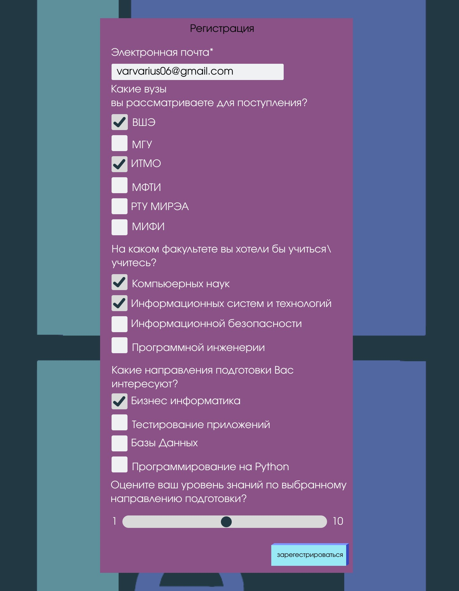
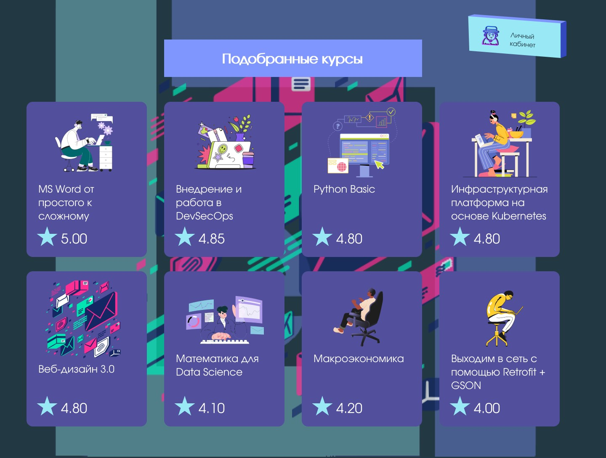

<div align="center">
  <h1 align="center">LeLa</h1>
  <h3>DaPoCa inc.</h3>
</div>

## Tech Stack

- Golang – Server
- Figma – HTML
- Figma – CSS
- Canva – Presentation
- PostgreSQL – Database

## Getting Started

### Prerequisites

Here's what you need to be able to run LeLa:

- Docker
- PostgreSQL Database

### 1. Clone the repository

```shell
git clone https://github.com/AntonimStudio/Itmo.git
```

### 2. Collect docker dependencies

```shell
docker install
npm install
npm start
```

### 3. Open the app in your browser

Visit [http://localhost:8000](http://localhost:3000) in your browser.

## Contributing

LeLa is an open-source project and we welcome contributions from the community.

If you'd like to contribute, please fork the repository and make changes as you'd like. Pull requests are warmly welcome.

## DB


## Frontend



